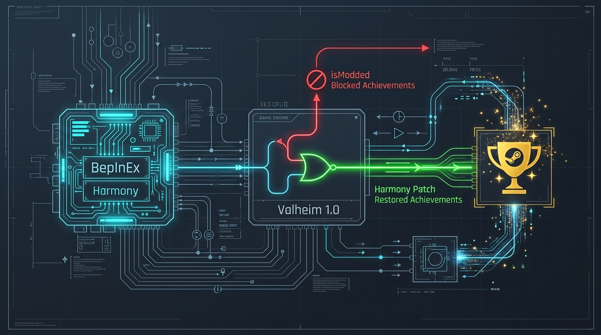
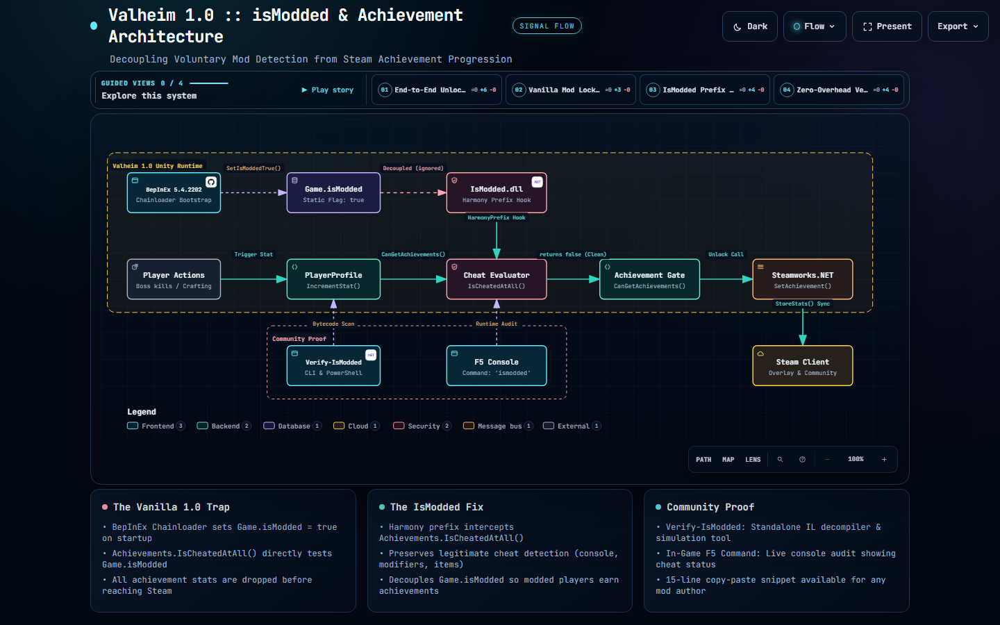

# Valheim 1.0 :: isModded & Achievements Guide
### *An Olive Branch to the Community: Why Mods Block Achievements in 1.0, and How to Restore Them*

[-blue.svg)](#)
[](#)
[](#)
[](./LICENSE)

---



## 🕊️ To the Valheim Modding Community

When Valheim 1.0 (Deep North / Ashlands) released, many players and server communities were met with an unexpected roadblock:
> **"We have learned that you cannot earn achievements while playing modded."**

If you love playing with quality-of-life mods—inventory sorting, camera tweaks, crafting helpers, or community server tools—suddenly you were faced with an unfair dilemma: **abandon your favorite mods or give up on Steam achievements.**

This repository is an **open-source olive branch** to the entire community: players, server admins, and mod developers alike. It contains:
1. A **crystal-clear explanation** of *why* this happens under the hood (no rumors or speculation—just the decompiled C# code).
2. A **visual architecture diagram** showing the exact call chain.
3. A **tiny 8.7 KB plugin** ([`dist/IsModded.dll`](./dist/IsModded.dll)) that restores achievements in 5 seconds.
4. A **15-line code snippet** that any mod author can copy directly into their own mods so users don't even need a separate plugin.
5. A **step-by-step testing guide** that anyone can follow to verify it works with zero technical background.

---

## 🗺️ Visual Architecture Diagram

Here is the entire system architecture compiled directly with [Archify](https://github.com/tt-a1i/archify):



> **Interactive Viewer**: Open [`docs/valheim-ismodded.html`](./docs/valheim-ismodded.html) in your browser for the full interactive diagram, featuring:
> - **4 Guided Story Views**: *End-to-End Unlock Flow*, *Vanilla Mod Lockout*, *IsModded Prefix Decoupling*, and *Zero-Overhead Verification*.
> - **Live Controls**: Pan, zoom, component inspections, and Dark/Light theme toggle.
> - **Specs & Vector Exports**: Source [`docs/valheim-ismodded.architecture.json`](./docs/valheim-ismodded.architecture.json) and standalone [`assets/architecture-archify.svg`](./assets/architecture-archify.svg).

---

## ⚡ The Quick Fix (For Players)

If you just want your achievements back while keeping your mods:

1. **Download** [`IsModded.dll`](./dist/IsModded.dll) (8.7 KB).
2. **Drop it** into your Valheim mods folder:
   ```text
   Valheim/BepInEx/plugins/IsModded.dll
   ```
3. **Launch the game.** Play normally. Your Steam achievements will unlock as you progress!

---

## 🧐 The "Why": What Actually Happened in 1.0?

Iron Gate did **not** create a complex anti-cheat system or scan your files for DLLs. What happened was the unintended consequence of an old, polite handshake.

### 1. The Polite Handshake (Years Ago)
Years ago, Iron Gate added a field in `Game.cs` with a polite comment asking mod authors to set it:
```csharp
// Inside Valheim's Game.cs:
public static bool isModded = false;

// "While we don't officially support mods in Valheim at this time,
// we ask that you please set the following isModded value to true in your mod.
// This will place a small text in the menu to inform the player that their
// game is modded and help us solving support issues. Thank you for your help!"
```

### 2. BepInEx Was Being Polite
To be good citizens, the BepInEx team added a method to their loader (`Chainloader.SetIsModdedTrue()`) that automatically finds `Game.isModded` and sets it to `true` whenever BepInEx runs.

### 3. Valheim 1.0 Tied It to Achievements
When Iron Gate added Steam Achievements in 1.0, they wrote a function to check if the player was cheating. Notice line 18 below:

```csharp
// Direct decompilation from Valheim 1.0 assembly_valheim.dll:
// Class: Achievements, Method: IsCheatedAtAll()
public static bool IsCheatedAtAll()
{
    if (Time.frameCount == Achievements.m_cheatCheckFrame)
        return Achievements.m_cheatCheckCache;

    Achievements.m_cheatCheckFrame = Time.frameCount;

    // Check if player used console devcommands
    bool profileCheated = (Game.instance != null) && Game.instance.GetPlayerProfile().m_usedCheats;
    // Check if server world has cheat modifiers (passive enemies, etc.)
    bool worldCheated = Achievements.IsWorldCheated();
    // Check if player has spawned items in inventory
    bool itemCheated = (Player.m_localPlayer != null) && Player.m_localPlayer.GetInventory().AnyCheatedItem();

    if (profileCheated || worldCheated || itemCheated)
    {
        Achievements.m_cheatCheckCache = true;
    }
    else
    {
        // <--- THE SMOKING GUN: If you didn't cheat, it checks this:
        Achievements.m_cheatCheckCache = Game.isModded; 
    }
    return Achievements.m_cheatCheckCache;
}
```

### 4. The Result
Because BepInEx sets `Game.isModded = true`, `Achievements.IsCheatedAtAll()` returns `true`.
Every time you craft an item, slay a boss, or chop a tree, `PlayerProfile.IncrementStat()` checks:
```csharp
if (!Achievements.CanGetAchievements(false)) return;
```
Because the game thinks you are "cheated," the achievement stat is immediately discarded, and Steam never receives the unlock signal!

---

## 🛠️ The Fix: How `IsModded` Works

`IsModded` uses a lightweight Harmony Prefix to hook `Achievements.IsCheatedAtAll()`.

It checks genuine cheats (`m_usedCheats`, `IsWorldCheated()`, `AnyCheatedItem()`), but **completely ignores `Game.isModded`**:

```csharp
[HarmonyPatch(typeof(Achievements), nameof(Achievements.IsCheatedAtAll))]
static class Achievements_IsCheatedAtAll_Patch
{
    [HarmonyPrefix]
    static bool Prefix(ref bool __result)
    {
        // 1. Check real cheats
        bool profileCheated = (Game.instance != null) && Game.instance.GetPlayerProfile().m_usedCheats;
        bool worldCheated = Achievements.IsWorldCheated();
        bool itemCheated = (Player.m_localPlayer != null) && Player.m_localPlayer.GetInventory().AnyCheatedItem();

        // 2. ONLY flag as cheated if actual cheats were used (ignore Game.isModded!)
        Achievements.m_cheatCheckCache = profileCheated || worldCheated || itemCheated;

        __result = Achievements.m_cheatCheckCache;
        return false; // Skip the vanilla method
    }
}
```

If you are playing with quality-of-life mods without using cheat commands, `IsCheatedAtAll()` returns `false`, `CanGetAchievements()` returns `true`, and Steam achievements unlock naturally!

---

## 🧪 How to Verify It (3 Independent Ways to Prove It Works)

We built three distinct verification methods so anyone—from a casual player to an experienced developer—can see and prove that achievements were blocked without this mod and are restored with it.

---

### Method 1: The One-Click Verifier App (`Verify-IsModded.exe`)
The lowest overhead, easiest method. Run [`dist/Verify-IsModded.exe`](./dist/Verify-IsModded.exe) (or [`tools/Verify-IsModded.ps1`](./tools/Verify-IsModded.ps1)):

It inspects your actual game files, decompiles the bytecode of `assembly_valheim.dll` live, and shows you a side-by-side simulation:

```text
================================================================================
        Valheim 1.0 :: isModded & Achievement Integrity Verifier                
================================================================================
[+] Valheim Directory : C:\Program Files (x86)\Steam\steamapps\common\Valheim

--- [STEP 1: INSPECTING VALHEIM 1.0 BYTECODE] --------------------------------
[OK] Found method: Achievements.IsCheatedAtAll()
Scanning instruction stream for Game.isModded access...
  -> IL_005B: ldsfld Game::isModded
  [CONFIRMED] Valheim 1.0 directly checks Game.isModded when evaluating cheats!
  If Game.isModded is True, the engine evaluates the session as CHEATED,
  which forces CanGetAchievements() to return FALSE.

--- [STEP 2: INSPECTING BEPINEX CHAINLOADER] ----------------------------------
[OK] Found BepInEx method: Chainloader.SetIsModdedTrue()
  -> BepInEx automatically sets Game.isModded = True on startup.

--- [STEP 3: CHECKING ISMODDED PLUGIN STATUS] --------------------------------
[PASS] Achievement bypass plugin detected: IsModded.dll
       Location: ...\Valheim\BepInEx\plugins\IsModded.dll
[PASS] Verified Harmony prefix hook targeting Achievements.IsCheatedAtAll

================================================================================
                               FINAL VERDICT                                    
================================================================================
Simulation of In-Game Achievement Evaluation (Legitimate Player with Mods):

  Condition                    | Without IsModded          | With IsModded
  -----------------------------+---------------------------+-----------------------
  BepInEx Running              | YES (Game.isModded=True)  | YES (Game.isModded=True)
  Character Devcommands        | FALSE                     | FALSE
  World Cheat Modifiers        | FALSE                     | FALSE
  Inventory Cheated Items      | FALSE                     | FALSE
  -----------------------------+---------------------------+-----------------------
  Achievements.IsCheatedAtAll  | TRUE  (Treats mod as cheat)| FALSE (Ignores isModded!)
  Achievements.CanGet          | FALSE [BLOCKED]           | TRUE  [RESTORED!]
  Steamworks.Unlock()          | NEVER CALLED              | CALLED ON PROGRESSION
  -----------------------------+---------------------------+-----------------------

>>> STATUS: READY! Your setup is configured to earn Steam achievements with mods.
```

---

### Method 2: Live In-Game F5 Command (`ismodded`)
1. In-game, press **F5** to open the Valheim console.
2. Type:
   ```text
   ismodded
   ```
3. It prints a live diagnostic report right inside the game engine, showing:
   - Whether `Game.isModded` is active.
   - What vanilla 1.0 would evaluate (Blocked).
   - What the active game evaluates with the patch (Restored & Working).

---

### Method 3: The "Meadows Pebble" 30-Second Live Test
1. Create a brand new character.
2. Load into a fresh single-player world.
3. Walk over to the first **Stone** or **Branch** on the ground and press **E** to pick it up.
4. **Watch the screen**: The in-game achievement notification will pop up, and your Steam overlay will chime with the unlocked achievement!

---

## 👨‍💻 For Mod Authors: Embed This in Your Own Mod

You do not have to tell your users to install `IsModded.dll`. If you maintain a mod (like `ComfyMods`, `ValheimPlus`, `Gizmo`, or your own QoL plugin), you can copy this single patch into your project:

```csharp
using HarmonyLib;
using UnityEngine;

[HarmonyPatch(typeof(Achievements), nameof(Achievements.IsCheatedAtAll))]
public static class RestoreModdedAchievementsPatch
{
    [HarmonyPrefix]
    public static bool Prefix(ref bool __result)
    {
        if (Time.frameCount == Achievements.m_cheatCheckFrame) {
            __result = Achievements.m_cheatCheckCache;
            return false;
        }
        Achievements.m_cheatCheckFrame = Time.frameCount;

        bool profileCheated = (Game.instance != null) && Game.instance.GetPlayerProfile().m_usedCheats;
        bool worldCheated = Achievements.IsWorldCheated();
        bool itemCheated = (Player.m_localPlayer != null) && Player.m_localPlayer.GetInventory().AnyCheatedItem();

        // Allow modded play to earn achievements!
        Achievements.m_cheatCheckCache = profileCheated || worldCheated || itemCheated;
        __result = Achievements.m_cheatCheckCache;
        return false;
    }
}
```

---

## ⚙️ Configuration Options

After launching the game once, a config file is generated at `Valheim/BepInEx/config/djc.valheim.ismodded.cfg`:

```ini
[General]
## Enable earning achievements while playing with BepInEx / mods loaded.
# Setting type: Boolean
# Default value: true
AllowWhileModded = true

## Optional: Enable earning achievements even if devcommands / cheats were used on this character or world.
# Setting type: Boolean
# Default value: false
AllowWithDevcommands = false

[Visual]
## Optional: Hide the 'Modded' watermark on the main menu.
# Setting type: Boolean
# Default value: false
HideModdedWatermark = false
```

---

## ❓ Frequently Asked Questions (FAQ)

### Can this get me banned on Steam or VAC?
**No.** Valheim is not a VAC-secured game (Valve Anti-Cheat is not used). Steam achievements for Valheim are client-stored via the standard Steamworks API (`SteamUserStats.SetAchievement`). Thousands of games allow modded achievements.

### Does this force cheats to enable achievements?
**No.** By default (`AllowWithDevcommands = false`), if a player actually uses devcommands or spawns items in with cheats, Valheim will still disable achievements for that character. This mod **only** stops BepInEx itself from counting as a cheat.

### Does this work on dedicated servers?
**Yes.** Achievements are strictly client-side. The server does not track or grant Steam achievements; your local Valheim client communicates directly with Steamworks.

---

## 📜 License & Community Rights

This project is licensed under the **MIT License**. Feel free to fork it, embed the code in your own mods, redistribute the DLL, or adapt it however your community needs.

*Skål, Vikings!*
